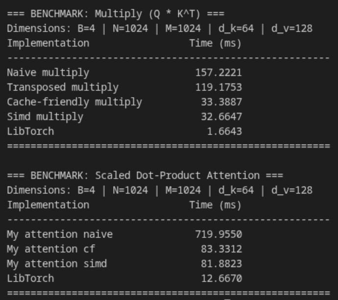

# Scaled Dot-Product Attention

## Зависимости

- GTest
- [LibTorch](https://pytorch.org/get-started/locally/)

## Сборка
```
cmake -S . -B ./build -DCMAKE_PREFIX_PATH="/путь/до/libtorch"
cmake --build ./build --config Release --target correctness_tests performance_tests -j $(nproc)
```

## Тестирование 

Запуск бенчмарков:
```bash
./build/tests/performance_tests
```

Проверка на корректность (сравнение с LibTorch):
```bash
./build/tests/correctness_tests
```

## О проекте
Реализация механизма **Scaled Dot-Product Attention** на C++. 

Проект включает в себя:
* **Класс `Tensor`**: Управление памятью, поддержка views.

Функционал разделен на две логические группы:
* **Математические**: `transpose`, `scale` и `multiply`.
* **Нейросетевые**: `softmax` и `attention`.

В проекте реализовано несколько алгоритмов умножения.

1. **Naive** -- классический алгоритм. Работает медленно из-за промахов мимо кэша.
2. **Transposed** -- на вход передается предварительно транспонированная правая матрица, чтобы обе матрицы читались строго последовательно.
3. **Cache-Friendly** -- изменение порядка циклов.
4. **SIMD AVX2** -- ручная векторизация внутреннего цикла.

## Характеристики тестирующего оборудования

OS: Fedora Linux 43 (Workstation Edition) x86_64

CPU: 13th Gen Intel(R) Core(TM) i5-13500H (16) @ 4.70 GHz

Memory: 15.24 GiB

## Результаты бенчмарков и профилирование

Замеры производились для размерностей: `Batch = 4`, `SeqLen = 1024`, `Heads = 64`. 
Профилирование выполнялось через утилиту `perf stat`.



---

### Анализ алгоритмов

**1. Naive multiply:** Процессор выполняет 25.1 млрд инструкций. Основные затраты времени приходятся на вычисление 3D-индексов (`operator()`) во внутреннем цикле и неэффективный паттерн доступа к памяти.

```cpp
inline void multiply_matrix_naive(const Tensor& lhs, const Tensor& rhs, Tensor& result,
                                  std::size_t batch_idx) noexcept {
    for (std::size_t i = 0; i < lhs.get_rows(); ++i) {
        for (std::size_t j = 0; j < rhs.get_cols(); ++j) {
            float sum = 0.0f;

            for (std::size_t k = 0; k < lhs.get_cols(); ++k) {
                sum += lhs(batch_idx, i, k) * rhs(batch_idx, k, j);
            }

            result(batch_idx, i, j) = sum;
        }
    }
}
```


**2. Transposed multiply:** Транспонирование правой матрицы обеспечивает линейное чтение данных. Количество инструкций снижается до 21.3 млрд, время выполнения сокращается со 157 мс до 119 мс. Прирост ограничен использованием скалярного произведения, которое создает горизонтальную зависимость данных при суммировании и блокирует автовекторизацию.

```cpp
inline void multiply_matrix_tr(const Tensor& lhs, const Tensor& rhs_tr, Tensor& result,
                               std::size_t batch_idx) {
    for (std::size_t i = 0; i < lhs.get_rows(); ++i) {
        const float* lhs_row_start = &lhs(batch_idx, i, 0);
        const float* lhs_row_end = lhs_row_start + lhs.get_cols();

        for (std::size_t j = 0; j < rhs_tr.get_rows(); ++j) {
            const float* rhs_col_start = &rhs_tr(batch_idx, j, 0);

            result(batch_idx, i, j) =
                std::inner_product(lhs_row_start, lhs_row_end, rhs_col_start, 0.0f);
        }
    }
}
```


**3. Cache-friendly multiply:** Количество выполненных инструкций сокращается до 4.9 млрд. Паттерн обхода памяти (`Y[j] = Y[j] + Alpha * X[j]`) устраняет зависимости по данным, что позволяет компилятору применить автовекторизацию и использовать инструкции FMA (Fused Multiply-Add).

```cpp
inline void multiply_matrix_cf(const Tensor& lhs, const Tensor& rhs, Tensor& result,
                               std::size_t batch_idx) noexcept {
    for (std::size_t i = 0; i < lhs.get_rows(); ++i) {
        float* res_row = &result(batch_idx, i, 0);

        for (std::size_t k = 0; k < lhs.get_cols(); ++k) {
            float lhs_val = lhs(batch_idx, i, k);
            const float* rhs_row = &rhs(batch_idx, k, 0);

            for (std::size_t j = 0; j < rhs.get_cols(); ++j) {
                res_row[j] += lhs_val * rhs_row[j];
            }
        }
    }
}
```


**4. SIMD multiply:** Количество инструкций составляет 4.7 млрд. Производительность сопоставима с версией Cache-friendly, так как компилятор для предыдущей версии сгенерировал примерно такой же ассемблерный код.

```cpp
inline void multiply_matrix_simd(const Tensor& lhs, const Tensor& rhs, Tensor& result,
                                 std::size_t batch_idx) {

    std::size_t K = lhs.get_cols();
    std::size_t N = rhs.get_cols();

    const float* lhs_base = &lhs(batch_idx, 0, 0);
    const float* rhs_base = &rhs(batch_idx, 0, 0);
    float* res_base = &result(batch_idx, 0, 0);

    for (std::size_t i = 0; i < lhs.get_rows(); ++i) {
        float* res_row = res_base + i * N;
        const float* lhs_row = lhs_base + i * K;

        for (std::size_t k = 0; k < K; ++k) {
            float lhs_val = lhs_row[k];
            const float* rhs_row = rhs_base + k * N;

            __m256 v_lhs = _mm256_set1_ps(lhs_val);

            std::size_t j = 0;
            for (; j + 7 < N; j += 8) {
                __m256 v_rhs = _mm256_loadu_ps(rhs_row + j);
                __m256 v_res = _mm256_loadu_ps(res_row + j);

                v_res = _mm256_fmadd_ps(v_lhs, v_rhs, v_res);

                _mm256_storeu_ps(res_row + j, v_res);
            }

            for (; j < N; ++j) {
                res_row[j] += lhs_val * rhs_row[j];
            }
        }
    }
}
```


### Выводы

Изменение порядка доступа к памяти ускоряет математические операции примерно в 4.7 раза по сравнению с базовой реализацией. Для Attention разница составляет 8.6 раз. Cache-friendly умножение показывает наименьшее время выполнения.
